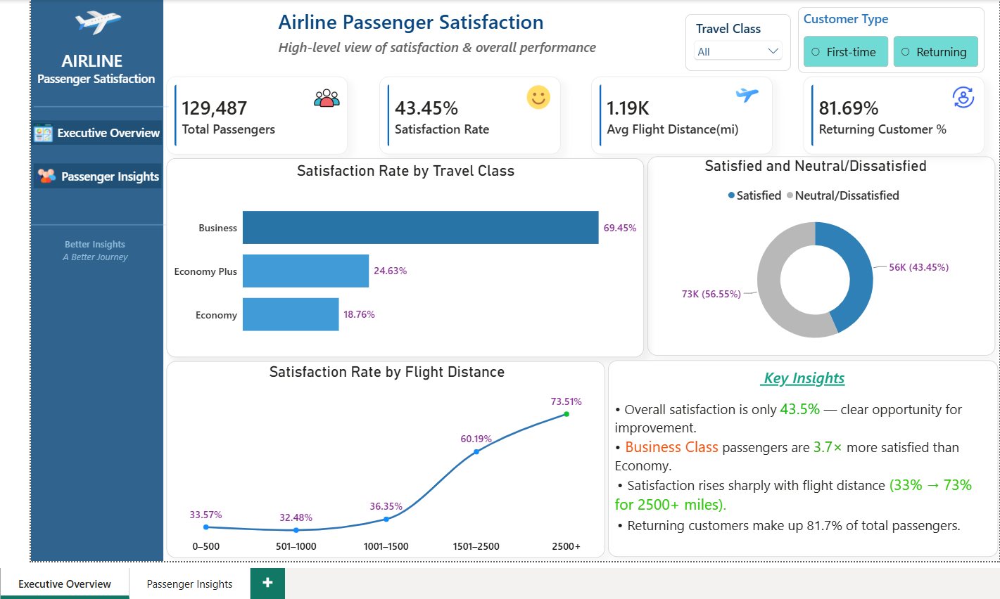
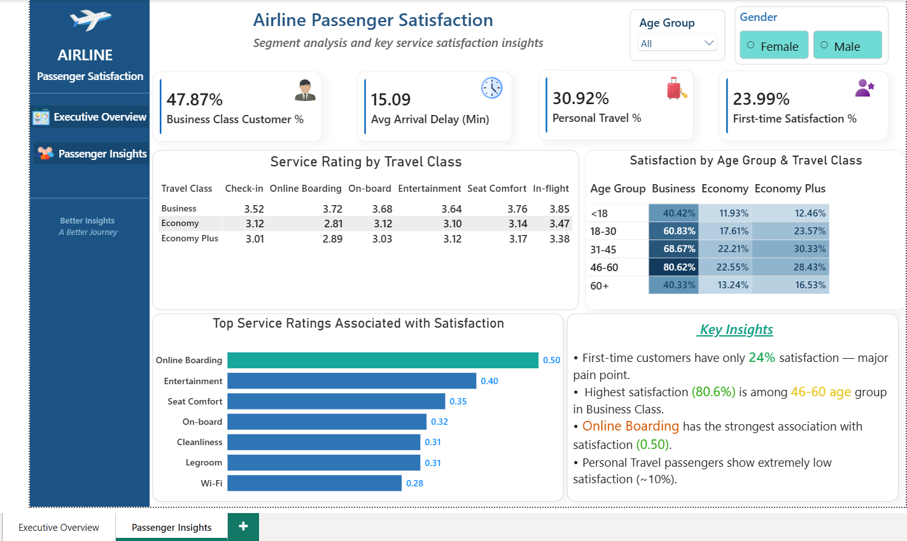

# ✈️ Airline Passenger Satisfaction Analysis

**End-to-end data analysis project** covering 129,487 airline passenger survey responses, using **SQL (PostgreSQL)** for analysis and **Power BI** for visualization — with a focus on satisfaction drivers, service quality, travel class behavior, and customer segmentation.

---

## 📑 Table of Contents

- [Project Overview](#-project-overview)
- [Business Problem](#-business-problem)
- [Key Business Questions Explored](#-key-business-questions-explored)
- [Dataset](#-dataset)
- [Data Cleaning & Quality Notes](#-data-cleaning--quality-notes)
- [Tools & Tech Stack](#️-tools--tech-stack)
- [Screenshots](#-screenshots)
- [Key Findings](#-key-findings)
- [Business Recommendations](#-business-recommendations)
- [Repository Structure](#-repository-structure)
- [How to Run](#️-how-to-run)
- [Connect With Me](#-connect-with-me)

---

## 📌 Project Overview

This project analyzes survey data from 129,487 airline passengers to understand what drives satisfaction — from service quality ratings to travel class, flight distance, delay tolerance, and customer loyalty status.

Using **SQL (PostgreSQL)** and **Power BI**, I explored satisfaction patterns across demographics, travel classes, and service categories — and identified which specific service factors are most strongly associated with overall passenger satisfaction.

---

## 📌 Business Problem

Only 43.5% of surveyed passengers report being satisfied overall — meaning the majority are neutral or dissatisfied. For an airline, this directly affects customer retention, brand perception, and repeat bookings. This project investigates which factors — service quality, travel class, flight distance, delays, or customer type — most strongly influence satisfaction, in order to identify where operational or service improvements would have the biggest impact.

---

## ❓ Key Business Questions Explored

1. Which age group shows the highest dissatisfaction rate?
2. How does satisfaction vary between first-time and returning customers?
3. Which travel class shows the highest dissatisfaction, and does this vary by customer type?
4. How do average service ratings compare across Business, Economy, and Economy Plus?
5. Does flight distance influence dissatisfaction levels?
6. At what level of departure delay does passenger convenience ratings start to decline?
7. Which service factors have the strongest correlation with overall satisfaction?
8. Which combination of customer type, travel type, and travel class has the highest satisfaction rate?
9. Which gender shows a lower proportion of returning customers?

> ✨ *...and additional insights derived from 16+ SQL queries across 6 analysis categories.*

---

## 📊 Dataset

| Property | Details |
|---|---|
| Source | Airline Passenger Satisfaction Dataset (Kaggle) |
| Total Rows | 129,487 |
| Travel Classes | 3 (Business, Economy, Economy Plus) |
| Overall Satisfaction Rate | 43.45% |
| Returning Customer % | 81.69% |
| Avg Flight Distance | 1,190 mi |

---

## 🧹 Data Cleaning & Quality Notes

Before analysis, the raw dataset was cleaned and standardized to ensure accuracy and consistency:

| Step | Action Taken |
|---|---|
| Missing values | Identified and removed rows with missing/null values |
| Column naming | Renamed columns to clear, consistent, snake_case naming for SQL readability |
| ID column | Removed — not relevant to analysis, retained only as a raw identifier |
| `arrival_delay` data type | Corrected from an incompatible/incorrect type to numeric, enabling accurate delay-based aggregation |

Cleaning was performed in Python (Pandas) prior to loading the dataset into PostgreSQL — see [`notebook/`](./notebook) for the full cleaning workflow.

---

## 🛠️ Tools & Tech Stack

| Tool | Purpose |
|---|---|
| Python (Pandas) | Data cleaning & preprocessing |
| PostgreSQL | Data storage & SQL queries |
| pgAdmin 4 | Query execution & output |
| Power BI | Interactive dashboard |

---

## 📸 Screenshots

Power BI Dashboard shows:
- Overall satisfaction rate, travel class breakdown, and satisfaction-by-distance trends
- Segment-level satisfaction by age group, gender, and travel class
- Service ratings most strongly associated with satisfaction

### Executive Overview
High-level snapshot: total passengers, satisfaction rate, average flight distance, and returning customer % — with satisfaction by travel class and by flight distance.



### Passenger Insights
Segment-level analysis: service ratings by travel class, satisfaction by age group & travel class, and the service factors most strongly linked to satisfaction.



📁 Interactive file: [`dashboard/`](./dashboard)

---

## 🔍 Key Findings

- 📉 **Overall satisfaction is low** — only **43.5%** of passengers report being satisfied, leaving clear room for improvement
- 💺 **Business Class passengers are 3.7× more satisfied** than Economy passengers (69.45% vs. 18.76%)
- 📏 **Satisfaction rises sharply with flight distance** — from 33% on short-haul flights (0–500 mi) to 73% on flights over 2,500 mi
- 🆕 **First-time customers report only 24% satisfaction** — a major retention risk, compared to the 81.69% share of passengers who are returning customers
- 🧑‍💼 **Highest satisfaction segment (80.6%)** is the 46–60 age group flying Business Class
- 🛜 **Online Boarding has the strongest correlation with satisfaction (0.50)** among all rated service factors
- 🧳 **Personal Travel passengers show extremely low satisfaction (~10%)**, a sharp contrast to business travelers

> ⚠️ *Key Findings will be updated as analysis progresses.*

---

## 💡 Business Recommendations

1. **Prioritize the Online Boarding experience above all other service factors** — it has the strongest measured correlation with satisfaction, meaning improvements here likely carry the highest return relative to other service investments.
2. **Investigate the first-time customer experience specifically** — with only 24% satisfaction among first-time flyers, the gap between first impression and long-term loyalty (81.69% returning) suggests early-journey friction that isn't visible in aggregate service ratings.
3. **Review the Personal Travel segment's experience separately from Business Travel** — a ~10% satisfaction rate is severe enough to warrant its own investigation into pricing, service expectations, or route quality for leisure passengers.
4. **Treat short-haul flights (0–500 mi) as a distinct improvement priority** — satisfaction here is less than half of long-haul flights, suggesting shorter trips may be underserved on comfort or convenience factors that matter less on longer flights.
5. **Use the 46–60 Business Class segment as a service benchmark** — understanding what drives their 80.6% satisfaction could inform standards applied to other class/age combinations.
6. **Monitor departure delay tolerance thresholds** — since convenience ratings decline at a measurable delay threshold, this can inform where operational recovery efforts (rebooking, communication) matter most.

---

## 📁 Repository Structure

```
airline-passenger-satisfaction-analysis/
│
├── dataset/
│   └── airline_satisfaction_cleaned.csv
│
├── notebook/
│   └── Airline_Passenger_Satisfaction.ipynb
│
├── sql_queries/
│   ├── data_overview.sql
│   ├── customer_satisfaction.sql
│   ├── travel_class_segmentation.sql
│   ├── flight_distance_delay.sql
│   ├── service_analysis.sql
│   └── satisfaction_association.sql
│
├── dashboard/
│   └── Airline_Passenger_Satisfaction_Dashboard.pbix
│
├── screenshots/
│   ├── page1_executive_overview.png
│   └── page2_passenger_insights.png
│
└── README.md
```

---

## ▶️ How to Run

1. Clone this repository
2. Open [`notebook/Airline_Passenger_Satisfaction.ipynb`](./notebook) to review the data cleaning steps, or use the pre-cleaned file directly from `dataset/`
3. Create a new database in PostgreSQL
4. Import `airline_satisfaction_cleaned.csv` into a table named `airline_satisfaction`
5. Run queries from the `sql_queries/` folder
6. Open the `.pbix` file in `dashboard/` using Power BI Desktop

---

## 📬 Connect With Me

**Rafat Khan** — Data Analyst

- 💼 LinkedIn: https://www.linkedin.com/in/rafat-khan-7215953a1/
- 🐙 GitHub: https://github.com/Rafat-khan10
- 📧 Email: rafatkhan2210@gmail.com
